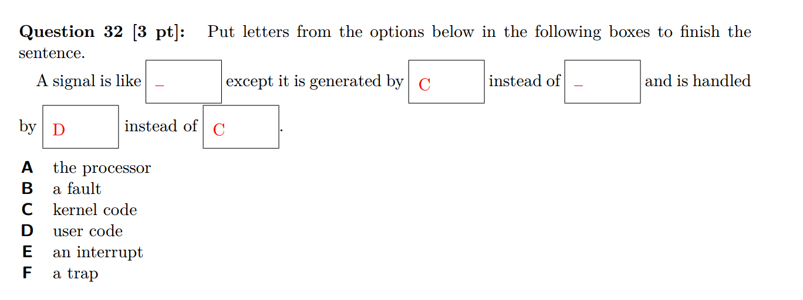
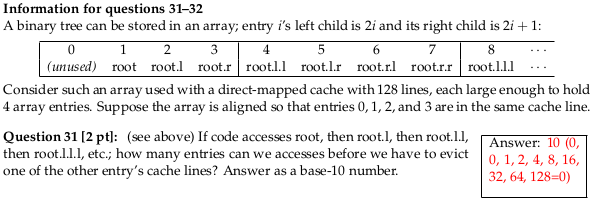
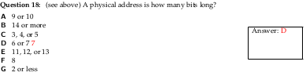
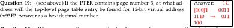
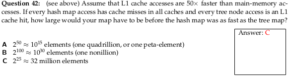

---
title: Explanations for Selected Old Exam Questions
...

# Spring 2016 Exam 1

## Question 12

> An unconditional C goto address statement is compiled as an assembly
jmp address and in Y-86 binary as a nine-byte sequence 70 addressIn8Bytes. A C label like L2:
is
> 
> *  A is a label in assembly and is a label in binary
> *  B is a label in assembly and is in binary but not as a label
> *  C is in assembly but not as a label and is in binary but not as a label
> *  D is a label in assembly and is not in binary
> *  E is not in assembly and is in binary
> *  F is in assembly but not as a label and is not in binary>
>
>  Key: D

Labels to appear in binary, but as immediate values not as labels or instructions of their own.

We have been more careful this semester to distinguish between label declaration and label use because we found this question confused students.  The question would not appear in this format this term.

## Quesiton 20

> Assume `x` and `y` are are declared as ints. Assume that all values are initialized to
> positive (non-zero, non-negative, finite) values.
>
> Each of the following present two expressions with a blank between them and gives
> a list of comparators. **Select all** options for twhich the resulting expression could be true
> for some value of the variables
>
> Question 20: `x + y ___ 0`
>
> *  A. ==
> *  B. <
> *  C. >
>
> Key: B and C

C for the typical case.

B is possible because of overflow; for example, `x == MAX_INT` and `y == MAX_INT`. (In this semester we did
not talk about signed integer overflow triggering undefined behavior.)

# Fall 2016 Exam 1

## Question 1

> Y86-64 has 12 icodes: halt, nop, rrmovq, irmovq, rmmovq, mrmovq, OPq, jXX, pushq, popq, call, and
ret. The following questions should be answered with the number of those 12 that have the listed
property. Valid answers range from 0 to 12.
>
> Question 1: How many set condition codes?

OPq is the only instruction that writes conditions codes. They compute a value and based on this computation change the condition codes. When designing the Y86-64 ISA, our textbook authors had the option of making other instructions write the condition codes, but did not.

jXX and cmovXX are the instructions that read condition codes and make a decision based on them (but do not set them.)

# Fall 2015 Exam 1

## Question 12

> Assume `x` and `y` are non-negative ints.
> For each question, write a relational operator (<, <=, ==, !=, >=, >) in the box that will make the
expression true for **all values** of x and y. Note that if < is true, so is <= and !=; in that case, write <.
If none of the relational operators is true for all x and y, write none.
> 
> Question 12: `(x < y) ? ((x << y) ___ (y << x)) : ((y << x) ___ (x << y))` (assume the same operator goes in both blanks.
> Answer key: none (`>=` without overflow)

Assuming 32-bit ints:

*  `(1 << 31) = -2147483648 < (31 << 1) = 62`
*  `(1 << 30) = 1073741824 > (30 << 1) = 60`

`(1 << 31)` being negative is the sort of overflow referred to.

## Question 15

> (Same setup as Question 12.)
>
> Question 15: `(x + y) ___ ((x ∧ y) + ((x & y) << 1))`
> Answer key: `==`

The general idea is that:

*   if bit i of x and y are both true, then, when adding, this will cause a 1 to be carried to the next bit --- this is the `(x & y) << 1` term.
*   if exactly one of bit i of x and of y are true, then this will contribute 1 that is not that carry bit to the answer --- this is the `(x ^ y)` term.

# Spring 2015 Exam 1

## Question 13

> A hardware multiplexer has 1 data output and 3 selection inputs; how many data inputs does it have? Answer as a number written in decimal (e.g., if the answer is eleven write 11, not 0xB or 0b1011).

A multiplexer has two kinds of inputs:

*   data inputs --- which contain values that might be passed to the output
*   selector inputs --- which decide which of the data inputs is passed to the output

Usually, we've generally spoken of the selector input as a single thing, but apparently in Spring 2015, when the selector input was multiple bits, each of the bits was considered a separate input.

So, the question is asking "if the MUX has 3 bits to select which of the inputs it uses, how many inputs does it have?"

The answer to that is 23 = 8 -- aka one selected with 000, one with 001, one with 010, 011, 100, 101, 110, and 111.

## Question 19

> Initially byte `i` of memory is `i + 0x20` (mod 256), `%eax` contains the number 3, and
> `%ebx` contains the number 5. What is in `%ebx` after running the x86 `movl (%eax), %ebx`
> (or Y86 `mrmovl (%eax), %ebx`)

(In this semester we used 32-bit Y86.)

So the memory address accessed by this movl is 3 (the value of eax). Memory around address 3 looks like:

| address | value |
| ------- | ----- |
| 0x02	| 0x22 |
| 0x03	| 0x23 |
| 0x04	| 0x24 |
| 0x05	| 0x25 |
| 0x06	| 0x26 |
| 0x07	| 0x27 |
| 0x08	| 0x28 |

The movl instruction accesses 32-bits -- 4 bytes -- of memory. In this case, that will be the bytes at addresses 0x03 through 06 inclusive. These are interpreted in little-endian so the value read is 0x26252423.

## Question 21

> Initially byte `i` of memory is `i + 0x20` (mod 256), `%eax` contains the number `0x01020304`, and
> `%ebx` contains the number 5. What is in byte 0x06 of memory after running the x86 `movl %eax, (%ebx)`
> (or Y86 `rmmovl (%ebx), %ebx`)

(In this semester we used 32-bit Y86.)

Q21: move the 4 byte (movl) value 0x01020304 (found in %eax) to address 5 (from %ebx).  Bytes to change:

       0    1     2     3     4    5   6   7   8
    [0x20, 0x21, 0x22, 0x23, 0x24, ??, ??, ??, ??, 0x2a, 0x2b, 0x2c, ...]

new values from little-endian

    [0x20, 0x21, 0x22, 0x23, 0x24, 0x04, 0x03, 0x02, 0x01, 0x2a, 0x2b, 0x2c, ...]

The byte at address 6 has 0x03 in it.

# Spring 2017 Exam 2

## Variant P, Question 2

> Consider executing the following sequence of insturctions on the
> pipeline design we discussed in lecture:
> 
>      pushq %rsp
>      rmmovq %rsp, 4(%rax)
>
> Which are **possible** forwarding paths for the value of `%rsp` between
> the two instructions?
The pipeline looks like:

    pushq %rsp             F D E* M W 
    rmmovq %rsp, 4(%rax)     F D  E *M W

(`*`s mark when the value of `%rsp` is computed or needed)

There are no stalls used because the result of pushq's addition to %rsp is available after its execute stage and not needed until rmmovq's memory stage.

Another is forwarding from the beginning or end of memory of pushq stage till the beginning or end of execute of rmmovq. 

Another is forwarding from the beginning of writeback of pushq till the beginning of memory of rmmovq, this is not one of the options.

Forwarding from execute to execute is not possible, since the execute stage of pushq doesn't happen at the same time as the execute stage of rmmovq.

# Fall 2016 Exam 2

## Question 1

> Suppose the value `0x9abcdef` is written to address `0x12345678` in a 4MB, 4-way associative,
> write-back cache with 256-byte blocks.
>
> Question 1: Which pieces of information that we provided are **not** needed to compute the **tag**?
> Select all that apply.
>
> A.  the write policy (correct)
> B.  the value (correct)
> C.  the cache size 
> D.  the block size (correct)
> E.  the address
> F.  the associativity

The write policy and value cannot affect the tag because it only changes what happens after tags are checked in the cache.

Since the cache is 4MB and has 4 ways, we know that each way has 1MB of data. This means that the number of sets S times the block size B is 1MB.

One way to determine the block size isn't needed is to think about the set index bits and block offset bits together. For a given byte with particular set index and block offset bits, there is exactly one place it go be stored within a cache way (the row determined by the set index and the column determined by the block offset). Since there are 1M bytes in a way, this means that there must be 20 (=log_2(1M)) set index + block offset bits. The remaining bits of the address must be the tag. With this reasoning, we determined the tag without using the block size.

Another way is to try to compute the tag bits while leaving the block size B as a variable. In this case, we find that S * B = 1MB (number of sets times block size), or S = 1MB / B. The number of set index bits is the log base 2 of S, or 20 - log_2(B). The number of block offset bits is the log base 2 of B. The number of tag bits is the memory address size minus set index bits minus block offset bits, or (assuming 64-bit addresses) 64 - (20 - log_2(B)) - log_2(B) = 64 - 20. Since we managed to cancel out B, we didn't actually need it to find the number of tag bits. Since we know the tag bits are at the start of the address, we also know exactly which bits of an address are the tag bits.

## Questions 16, 18

> Consider the two versions of following C code, which differ only in loop order. Assume that `N` is
> a large constant.
> 
> ***Version 1.***
> 
>     for (int i = 0; i < N; ++i)
>         for (int j = 0; j < N; ++j)
>         foo[j * N + i] -= bar[i * N + i] + bar[j * N + i];
>
> ***Version 2.***
>
>     for (int j = 0; j < N; ++j)
>         for (int i = 0; i < N; ++i)
>             foo[j * N + i] -= bar[i * N + i] + bar[j * N + i];
>
> Question 16: Which has spatial locality for foo?
>
> Question 18: Which has temporal locality for foo?

A general rule of thumb:

*  weak temporal locality: use a few times in a single iteration of a loop
*  strong temporal locality: index does not chnage between iterations of the innermost loop
*  weak spatial locality: the total size covered by the innerloop(s) is (are) likely small enough to fit into cache
*  strong spatial locality: innermost loop moves by a single index between iterations

# Fall 2016 Final Exam

## Question 2
 
> Suppose a system uses 8192-byte (213 bytes) pages and
> a two-level page table, where each level of the page table has one page
> of 4-byte page table entries with the following format:
> 
> | bit 0 | present (not on disk) |
> | bit 1 | readable/executable |
> | bit 2 | writable |
> | bits 6-29 | physical page number |
> | other bits | not relevant to these questions |
>
> (Bit 0 is the least significant bit of the page table entry when 
> it is interpreted as an integer.)
>
> Question 2:
>  If the last-level page table entry for the virtual address
> `0x12345678` has the value `0x103` and the processor is trying
> to read an instruction from that address, what memory address
> will be read?

Writing out the bits of the page table entry gives:
`0000 .... 0000 0001 0000 0011`
Removing the last 6 bits yields the physical page number '0000 ... 0000 0100', which 
is concatenated with the page offset. The page offset is the lower 13 bits
of `0x12345678`, which is `1 0101 0111 1000`, yielding `100:1 0101 0111 1000`
or `0x9678` (the `:` represents the seperation between page offset and 
physical page number.)

Endianness is not an issue here because the question gives the integer value of the
PTE, not the sequence of bytes stored in memory.

## Question 3

> (Same setup as question 2.)
> Question 3: How many bits does a virtual address have on this platform?

With 2^13 bytes per page table and 4 bytes per page table entry, that's 2^11 page table entries per page table. So page tables at each level need 11 bits from the address to look up one of the 2^11 page table enties. Since there are two levels, this means 11*2=22 bits of VPN.

## Question 4

> (Same setup as quesiton 2.)
> Question 4: If this system had an 8-entry, 4-way set associative TLB, then accessing
> the address `0x12345678` requires accessing the same TLB set as:

Recall that TLB maps the virtual page number to a page table entry. Somewhat like a normal cache, the TLB divides the virtual page number into an index and a tag.[*] Since the TLB has 8 entries and 4 ways, it has two sets. Therefore, there is one set index bit and all the other bits of a virtual page number are part of the tag. Like in caches, the set index bits are lower-order bits, to better take advantage of spatial locality. So, the set index for the TLB lookup for each address is the lowest bit of the VPN. Since page offsets take up the lowest order 13 bits of each virtual address, this is 14th lowest order bit of each address.

In the given address 0x12345678 (0x5678 = binary 0101 0110 0111 1000) this is a 0.
 
*  A: In 0x12399789 (0x9789 = binary 1001 0111 1000 1001) this is also 0, so 0x12399789 is in the same set.
*  B: In 0x1234FFFF, this is 1, so it is not in the same set
*  C: In 0x8678, this is 0, so it is in the same set
*  D: In 0x7F665F02, this is 0, so it is in the same set
*  E: In 0xFF6789, this is 1, so it is not in the same set.

So the answer should have been ACD. That there were multiple correct answers and it wasn't marked none-of-the-above is why it was dropped.

[*] TLBs don't have any equivalent of "block offset" bits because there's generally exactly one page table entry per TLB "block". There's probably not enough spatial locality between pages for larger "blocks" to be worthwhile or, if there is, making pages bigger would be a better option.

## Question 12

> Consider a Y86-64 processor where:
>
> *  The execute stage is slowest when adding, requiring 1 ns to complete.
> *  The memory stage is slowest overall, requiring 1.5 ns to complete.
> *  All other stages are faster than these two.
> 
> Assume we add a new ifun to OPq: mulq, which requires 1.8 ns in the execute stage.
>
> Question 12: If this is a sequential processor, how much slower will the clock cycle be?

All commands that use memory also use execute, and use it to add.  Thus, the Execute+Memory time for memory instructions is 2.5ns.

OPq does not use memory, so its old Execute+Memory time was 1ns.  Adding in mulq, it changes to 1.8ns.  Both are still faster than 2.5ns that was available for E+M already, so no change in clock speed is needed.

This question was intended to get at the difference between sequential and pipelined timing.

## Question 15
> Consider the following Y86-64 code:
>    
>     irmovq $0x10, %rcx
>     irmovq $0x10000, %rax
>     addq %rcx, %rcx
>     mrmovq 0(%rax), %rbx
>     subq %rax, %rcx
>
> Question 15 [2 pt]: (see above) If the system uses 4096-byte pages and a 4-level page table
> with 4-byte page table entries and the page table base register is set to page number 0x10, what
> was the address of the first-level page table entry accessed before the page fault?

This virtual address has virtual page number 0x10. As long as page tables have at least 32 entries, this means the first, second, and third parts (for the first-, second-, and third-level page tables of the VPN are 0, and the last part is 0x10. [The question should have specified some restriction on the size of page tables, such as each page table being one page.]

Since the first-level part of the VPN is 0x0, the first-level page table entry is the first one in the first-level page table. The location of the first-level page table is physical page 0x10, the first byte of this page has address 0x10000. This is also the first byte of the first page table entry, and so the answer. Since it's not one of the choices, the answer is "none of the above".

## Question 24

> Question 24: Answer true or false for each of the following:
>
> *   A: If the ISA had only one kind of **interrupts**, software could emulate the other kinds by setting a register value before triggering the **interrupt**
> *   B: If the ISA didn't have **traps**, software could emulate them by setting a register value and then triggering a **fault**
> *   C: If the ISA had only one kind of **interrupts**, software could emulate the other kinds by setting a register value before triggering the interrupt
> *   D: If the ISA had only one kind of **fault**, software could emulate the other kinds by setting a register value before triggering the fault

A and D are false because interrupts are always external events, not triggered by software.

For C, faults are side-effects of the processor detecting a problem, and the OS can't reliably know what the problem (i.e. the type of fault) was without being told by the processor. In general, the software can't anticipate whether, for example, a rmmovq will fail due to a page fault (PTE is invalid) or a protection fault (PTE is valid but not writeable).

For B, we could have a convention like "instead of making a system call using a system call instruction, try to access address 0xFFFFFFFF, which I know will always be a page fault". Given this, the OS's exception handler for page faults could first check to see if it has a "special" page fault and handle it like a system call. Since traps like system call instructions are always triggered deliberately, this type of mechanism would be a valid substitute for direct processor support for traps.

## Question 32

I believe we didn't count the answers marked '-' towards the score. The box after "generated by [C] instead of ____" should be A.

The first box is a bit problematic because signals are used in situations which are similar to:

*  faults --- for example, SIGSEGV (sent to a process when it accesses invalid memory) or SIGFPE (sent to a process when it performs something like a divide-by-zero)
*  interrupts -- for example, signals sent by another process via kill() or from a timer like one setup through the alarm() or timer_create() [see their manpages].
*  traps --- for example, signals generated using the raise() library call
*  aborts --- for example, the intended use of SIGPWR whose description is "Power failure".

The ideal answer would be some option that just said "an exception"

## Question 40-41

> Consider the following C snippet:
>
>      unsigned char array[1024 * 1024];
>      ...
>      for (int iteration = 0; iteration < 2; ++iteration) {
>          for (int i = 0; i < 4096; i += 8) {
>              array[i] += 1;
>          }
>      }
> Assume that only accesses to `array` use the data cache (all other
> values are kept in registers) and that `array[0]` is stored in the
> first byte of a cache block.
> 
> **Question 40:**
> If this snippet is run with an initially empty 2KB, direct-mapped data cache
> with 32-byte blocks, how many cache misses will occur?
>
> **Question 41:**
> If this snippet is run with an initially empty 3KB, 3-way set associative data cache
> with 32-byte blocks and an LRU replacement policy, how many cache misses will occur?

Let's just consider question 40:

First let's figure out what parts of the array map to the same cache set. This is important because blocks can only be evicted from the cache due to other accesses mapping to the same set.

Since this 3KB cache has a 3-ways, each "way" is 1KB, so values which are 1KB apart in memory map to the same set of the cache. (We "wrap around" in placing things in cache sets after 1KB.)

Then we can look at the accesses to the array. They fit in to three categories:

*  Accesses to a cache block for the very first time. This happens for array[0], array[32], etc. in the first iteration of the loop. These must be misses and there are 4096/32 = 128 of them. (One per cache block.)
*  Accesses to the same cache block that was just accessed. This happens for array[8], array[16], array[24], etc. These must be hits.
*  Accesses to a cache block that has been accessed before, but after more recently accessing three other blocks that map to the same set. This happens during the second iteration of the outermost loop. For example, when array[0] is accessed for the second time, array[3072], array[2048] and array[1024] were all accessed more recently (during the previous iteration of the outermost loop). This means that if array[0] was in the cache, it must have been replaced by the LRU replacement policy. Therefore these must be misses and ther eare 4096/32 = 128 of them. (One per cache block.)

By similar reasoning, you will get the same number of misses for question 41, but it's simpler since each set can only hold one block.

Another way of figuring this out is to write down the access pattern for a set and track the actual contents of the set. For example, for the set that contains array[0] through array[31] and array[1024] through array[1024+32], etc.

# Spring 2016 Final Exam

## Question 31

The numbers in parenthesis on the answer key are the indexes of the cache blocks accessed, assuming the index for 'root' 0. root accesses 0, root.l accesses 0, root.l.l accesses index 1 (the next block), root.l.l acceses index 2, root.l.l.l accesses index 4, and so on.

When we reach would what be cache index 128, the cache indices wrap around -- since there are only 128 sets -- and that really maps to index 0. So, to store it in the cache, the cache must evict the block containing the root.

(I did this calculation assuming the root maps to index 0, but things work out the same if the root is, say, index 120, then we access 120+0, 120+1, 120+2, 120+4, 120+8 mod 128 (=0), 100+16 mod 128 (= 8), ... 120+128 mod 128 = 120. Just all our indices are adjusted by 120.)

## Question 37

> Consider 38-bit virtual addresses and 4-byte page table entries, where each PTE stores 8 bits of metadata
> (executable, protected, etc.)
>
> Question 37: If you have 256-byte pages, then the largest possible physical address space is how many bytes?

I don't understand where the key gets its answer. My impression: with 4 byte PTEs, there are 24 bits for physical page numbers, for a total of 32 bits of physical address, for 4GB address space. I don't see any other constraints on address space size.

## Question 38

> Consider 38-bit virtual addresses and 4-byte page table entries, where each PTE stores 8 bits of metadata
> (executable, protected, etc.)
> 
> Question 38: If you want to have a single-level page table and fit each page table in 
> a single page of memory, what is the smallest page size (in bytes)
> you could use? Answer as a power of two, such as 16B or 128GB.

Let's say we have K bit page offsets, meaning 2^K byte pages. Then we have at most 2^K/4 = 2^(K-2) page table entries per page. Since the single page tables is one page, this which allows for up to K-2 bits of VPN, so 38 = VPN bits + page offset bits >= K-2 + K, or K >= 20. 2^20 bytes is 1MB.

## Question 39

> Consider 38-bit virtual addresses and 4-byte page table entries, where each PTE stores 8 bits of metadata
> (executable, protected, etc.)
> 
> Question 38: If you want to have a three-level page table and fit each page table in 
> a single page of memory, what is the smallest page size (in bytes)
> you could use? Answer as a power of two, such as 16B or 128GB.

Let's say we have K bit page offsets, meaning 2^K byte pages. Again, we have at most 2^(K-2) PTEs per page. Since we have three levels, this allows for up to K-2 vits of VPN per level. So 38 = VPN bits + page offset bits >= 3(K-2) + K or 44 >= 4K or  K <= 11. 2^11 bytes is 2KB.

# Fall 2015 Final Exam

## Question 7

There is a unstated assumption in the question that page tables are exactly one page. I believe this is how virtual memory was taught in Fall 2015, but it is not generally true of how virtual memory works.

Given this, with 4K pages, we have 16 bit VPNs. With a one-level page table, this would require 2^16 page table entries fit in 4K, which would require PTEs be less than 1 byte. With a two-level page table, this would require 2^8 page table entries fit in 4K, which is possible with 2^4 = 16 byte PTEs.

## Questions 13-15

> Assume that each page table entry is 1 byte (8 bits); from most- to least-significant bit these mean 1
bit 'on disk'; 4 bits 'page number'; 1 bit 'kernel mode'; 1 bit 'executable'; and 1 bit 'read-only'.
Suppose that, in the course of resolving an address using a two-level page table you encounter
first a page table entry with value 0x3E, then one with value 0x7D.
> 
> Question 13: Code that may access this memory may also execute its contents as code. True or false? (False;
> second PTE does not have executable bit set)
>
> Question 14: User-mode code can access this memory. True or false? (False; both PTEs have kernel-mode bit
> set.)
>
> Question 15: Code that may access this memory may also update its contents. True or false? (False;
> second PTE has read-only bit set.)

If, at any point, a PTE has a protection bit set that the current memory access violates, a page fault is generated and the address translation does not continue.

In general, the OS will create page tales with a transitive property on page table protection bits, so that once you encounter (say) a kernel-mode bit, you'll encounter it all the way down to the last page table.  But this is the OS's decision, not enforced by hardware.

## Question 18

Since pages are 8 bytes long, we need 3 bits to determine of the bytes of a page we are talking about. So the bottom 3 bits of the address of the page offset. The remainder of a physical address it the physical page number -- which page we are accessing. The question indicates that these are 4 bits long, so the total is 3+4=7 bits in every physical address.

## Question 19

Not stated is an assumption that each page table is one page long. Since PTEs are 1 byte, each page table contains 8 page table entries. Looking up page tables at each level requires 3 bits from the VPN.

Since each page is 8 bytes long, the there are 3 bits of page offset and 9 bits of VPN in the 12-bit address. The first 3 bits of the VPN, used to look up the top-level page table entry has index 4 (binary 100) as indicated in the key ([100]1 (9) 0011 (3) 1110 (E)).

Since the PTBR contains page number 3, the first PTE is located at address 3 << 3 AKA 3 * 8 AKA 0x18 (the physical address with PPN 3 and page offset 0). To get to the page table entry with index 4, we to add 4 * PTE size = 4 to that to skip over 4 PTEs, giving 0x18 + 4 = 0x1C.

## Question 30

> Consider a ten-stage pipline, with stages named S0 through S9.
> 
> Suppose the <tt>mul</tt> instruction in this architecture requires its operands before beginning
> S3 and
> produces its result by the end of S5, writing it back to the register file in S9.
> Suppose both the add instruction and the shift instructions in this architecture require their
> operands before beginning S3 and produces their result by the end of S3, writing it back to the
> register file in S9.
> 
> Assume there is data forwarding available.
>
> 30. What is the latency of mul?

With forwarding, you can produce the operands for mul in an earlier instruction and
3 cycles later use the result of mul in a later instruction. Thus, the effective latency
of the actual multiplication is 3 cycles, even though the processor does some additional
bookkeeping of the mul operation before and after. This is the most natural idea of instruction
latency, and typically what we mean we talk about the latency of an instruction.

This, however, isn't the latency in the sense of:

*  the time from when we discover we need to run a mul instruction until when the results are available,
   which is 6 cycles;
*  the time from when we discover we need to run a mul instruction until when the results are available
   without forwarding, which is 10 cycles

# Spring 2015 Final Exam

## Question 24

> Assume the following:
>
> *   each page table fits on a single page
> *   you have 6 bits of flags
> *   page table entries are a power-of-two number of bytes long (1B, 2B, 4B, etc.)
> *   you are minimizing wasted space in page tables
>
> Question 24:
> If each virtual address is 28 bits long and each physical address is 24 bits long, how
> large should pages be?

One strategy to solve this is to represent the size of a page as a variable.

For example, let's suppose there are 2^K bytes in a page table. Then, there are K bits in each page offset and (24-K) bits in each physical page number. Similarly, there are (28-K) bits in the virtual page number.

If there are more than 10  bits in the PPN, then page table entries will be 4B long (or more). This would mean that 2^K/4 page table entries fit in a page, so we have 2^(K-2) page table entries per page. If our page table has no wasted page table entries, this would mean that we use K-1 bits from each virtual page number to access it. If we have a single-level page table, wasting no page table entries would imply 28-K=K-1, or K = 15. In this way, we don't waste any whole page table entries, but we have 32 - 15 - 6 = 11 unused bits in each page table entry. so we'd always waste some space with a single level table. 2^15 is 32K, so this is where the marked answer comes from.

If there are 10 or less bits in a physical page number, the page table entries can be 2B long (or less). This gives 2^(K-1) PTEs/page. If we have a two-level page table, wasting no page table entries would imply (28-K)/2=K-1(we divide the VPN into two equally sized pieces), or K=10. With K exactly 10, it also turns out that we don't waste any space in each page table entry either, so this minimizes wasted space in the page tables. So, I think it's a mistake that F (2^10 = 1K) isn't listed as a correct answer.

## Question 42

A hashmap will need one uncached access which takes 50 units of time.

The question states that treemaps need 2lg(N) accesses, each of which is a cache hit that takes 1 unit of time. lg(N) represents log base 2 of N. (I'm not sure this is the best model of binary tree accesses, but it's what the question says.)

Setting 2lg(N) = 50 and solving for N yields 2^25, which is the answer given.

# Fall 2014

## Question 13
> Question 13: Core i7 uses a 4-level page table hierarchy with 4K pages for a total virtual address size of 48 bits. If we tweaked it to use 8K pages and a 3-level page table hierarchy, how large would virtual addresses be?
> Answer: 42 or 43 bits

The question should probably state that  page tables at each level should fit on one page and that page table entries are 8B.

Given this, 8K pages + 3-levels gives at  13-bit page-offset and three 10-bit (2^10 entries in an 8K page) VPN parts for each level o the page table, for a total of 43 bits.

## Question 14 
> Question 14: Suppose page table entries are 8 bytes long and virtual addresses are 32 bytes long. If each page table is to fit on a single page, what is the smallest pages can be if we have a 2-level page table hierarchy?

Assuming 32 bytes is a typo for 32 bits:

Let's represent the number of bits of page offset as K. Then pages are 2^K bytes, and each page table level has at most 2^(K-3) entries. Virtual addresses have a K-bit page offset, and two at most (K-3)-bit VPN parts, for a total size of  at most K + 2(K-3) = 3K-6. Solving 3K-6=32 yields 3K=38 or K = 12 + 2/3. Making K=12, gives at most 3*12-6 = 30 bits in a virtual address, making K=13 gives at most 3*13-6 = 33 bits in a virtual address, so 8K pages are the smallest possible size.

If 32 bytes is not a typo:

We get 3K-6 = 32*8 gives K greater than 32, which gives a page size greater than 2^32 B, which is clearly larger than the possible options.

